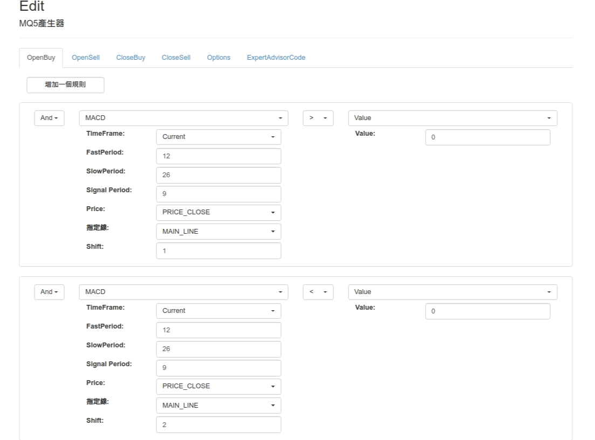
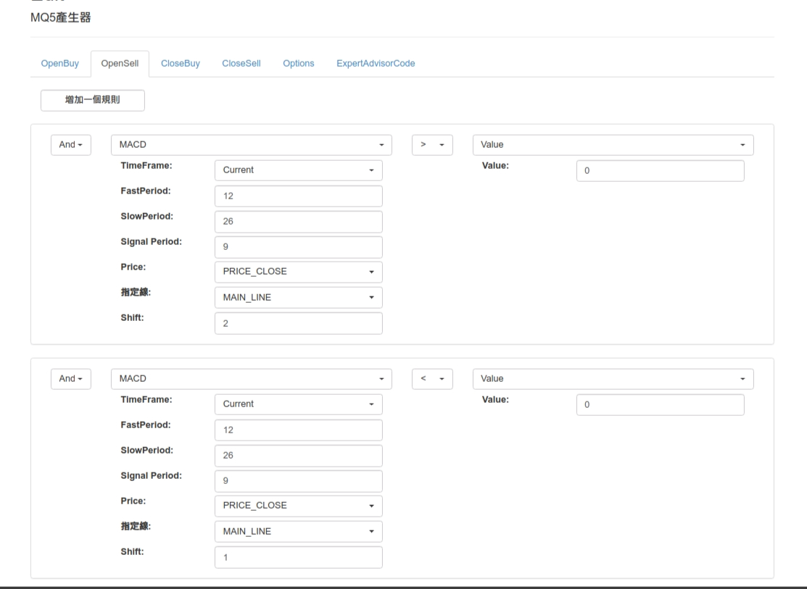
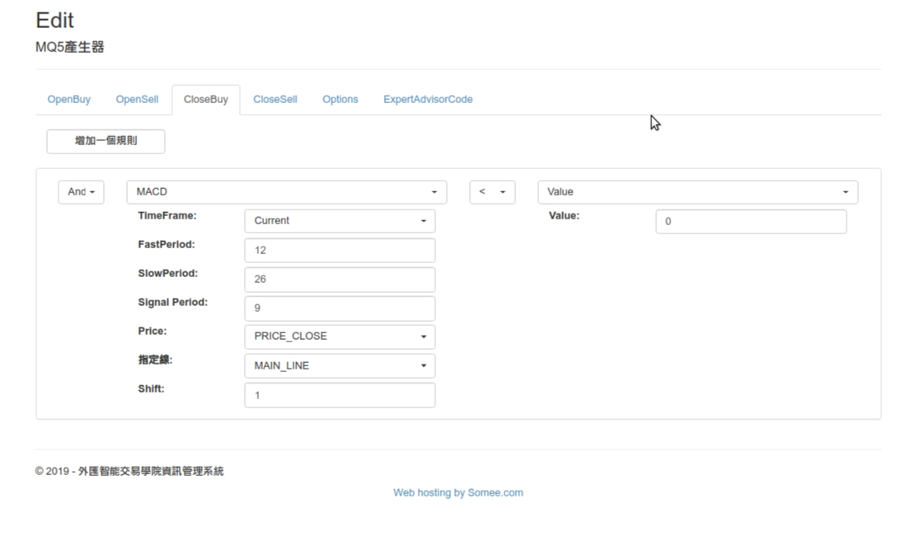
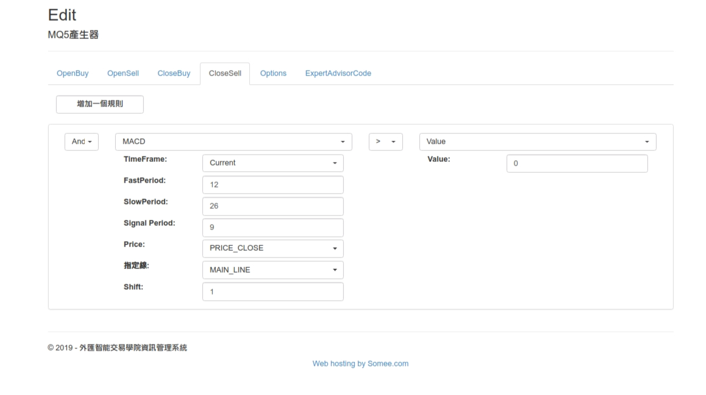

# MACD


## MACD 突破買賣範例


```c
// +------------------------------------------------------------------+
// |                                                         GenCode.mq5 |
// |                                         Copyright 2017, BeeQuant |
// |                                https://www.facebook.com/Beequant |
// +------------------------------------------------------------------+
#property copyright "Copyright 2017, BeeQuant"
#property link      "https:   // www.facebook.com/Beequant"
#property version   "1.00"
// 內部宣告---------------------------------------------------------------
double Ask, Bid;
int 避免同根重複下單的風控變數 = 0;
int 避免同根重複平倉的風控變數 = 0;
// 外部宣告---------------------------------------------------------------
input int MagicNumber = 12345;
int macdH_1_1;
double macd1_1_1[];
double Value_1_2;
int macdH_2_1;
double macd1_2_1[];
double Value_2_2;
int macdH_3_1;
double macd1_3_1[];
double Value_3_2;
int macdH_4_1;
double macd1_4_1[];
double Value_4_2;
int macdH_5_1;
double macd1_5_1[];
double Value_5_2;
int macdH_6_1;
double macd1_6_1[];
double Value_6_2;
// +------------------------------------------------------------------+
// | Expert initialization function                                   |
// +------------------------------------------------------------------+
int OnInit()
{
    // ---
    ArraySetAsSeries(macd1_1_1, true);
    ArraySetAsSeries(macd1_2_1, true);
    ArraySetAsSeries(macd1_3_1, true);
    ArraySetAsSeries(macd1_4_1, true);
    ArraySetAsSeries(macd1_5_1, true);
    ArraySetAsSeries(macd1_6_1, true);
    // ---
    return (INIT_SUCCEEDED);
}

// +------------------------------------------------------------------+
// | Expert deinitialization function                                 |
// +------------------------------------------------------------------+
void OnDeinit(const int reason)
{
    // ---
}

// +------------------------------------------------------------------+
// | Expert tick function                                             |
// +------------------------------------------------------------------+
void OnTick()
{
    Ask       = SymbolInfoDouble(Symbol(), SYMBOL_ASK);
    Bid       = SymbolInfoDouble(Symbol(), SYMBOL_BID);
    macdH_1_1 = iMACD(Symbol(), 0, 12, 26, 9, PRICE_CLOSE);
    CopyBuffer(macdH_1_1, 0, 0, 12, macd1_1_1);
    macdH_2_1 = iMACD(Symbol(), 0, 12, 26, 9, PRICE_CLOSE);
    CopyBuffer(macdH_2_1, 0, 0, 11, macd1_2_1);
    macdH_3_1 = iMACD(Symbol(), 0, 12, 26, 9, PRICE_CLOSE);
    CopyBuffer(macdH_3_1, 0, 0, 11, macd1_3_1);
    macdH_4_1 = iMACD(Symbol(), 0, 12, 26, 9, PRICE_CLOSE);
    CopyBuffer(macdH_4_1, 0, 0, 12, macd1_4_1);
    macdH_5_1 = iMACD(Symbol(), 0, 12, 26, 9, PRICE_CLOSE);
    CopyBuffer(macdH_5_1, 0, 0, 11, macd1_5_1);
    macdH_6_1 = iMACD(Symbol(), 0, 12, 26, 9, PRICE_CLOSE);
    CopyBuffer(macdH_6_1, 0, 0, 11, macd1_6_1);
    // 多單
    if (多單筆數() == 0 && 買進的條件()) {
         Print("11111111111111111122");
        if (避免同根重複下單的風控變數 != Bars(Symbol(), 0)) {
            bool b = buy(Symbol(), 0.01, Ask-1000*Point(), Bid+1000*Point(), "BQGenCode BUY ", MagicNumber);
            if (b) {
                避免同根重複下單的風控變數 = Bars(Symbol(), 0);
            }
        }
    }
    // 多單出場
    if (多單筆數() > 0 && 多單平倉的條件() ) {
        if (避免同根重複平倉的風控變數 != Bars(Symbol(), 0)) {
            多單平倉();
            避免同根重複平倉的風控變數 = Bars(Symbol(), 0);
        }
    }
    // 空單
    if (空單筆數() == 0 && 賣出的條件()) {
        if (避免同根重複下單的風控變數 != Bars(Symbol(), 0)) {
            bool b = sell(Symbol(), 0.01, Bid+1000*Point(), Ask-1000*Point(), "BQGenCode SELL ", MagicNumber+77);
            if (b) {
                避免同根重複下單的風控變數 = Bars(Symbol(), 0);
            }
        }
    }
    // 空單出場
    if (空單筆數() > 0 && 空單平倉的條件() ) {
        if (避免同根重複平倉的風控變數 != Bars(Symbol(), 0)) {
            空單平倉();
            避免同根重複平倉的風控變數 = Bars(Symbol(), 0);
        }
    }
} /* OnTick */

// +------------------------------------------------------------------+
// |                                                                  |
// +------------------------------------------------------------------+
double CopyBuffer(int handle, int index, int shift)
{
    double buf[];

    switch (index) {
        case 0: if (CopyBuffer(handle, 0, shift, 1, buf) > 0)
                return (buf[0]);

        break;
        case 1: if (CopyBuffer(handle, 1, shift, 1, buf) > 0)
                return (buf[0]);

        break;
        case 2: if (CopyBuffer(handle, 2, shift, 1, buf) > 0)
                return (buf[0]);

        break;
        case 3: if (CopyBuffer(handle, 3, shift, 1, buf) > 0)
                return (buf[0]);

        break;
        case 4: if (CopyBuffer(handle, 4, shift, 1, buf) > 0)
                return (buf[0]);

        break;
        default: break;
    }
    return (EMPTY_VALUE);
}

// ---------------------------------------------------------買進的條件
bool 買進的條件()
{
    if (
        ( macd1_1_1[2] < 0) && ( macd1_2_1[1] > 0)
    )
    {
        return true;
    } else {
        return false;
    }    // **/
}

// ---------------------------------------------------------賣出的條件
bool 賣出的條件()
{
    if (
        ( macd1_3_1[1] < 0) && ( macd1_4_1[2] > 0)
    )
    {
        return true;
    } else {
        return false;
    }    // **/
}

// ---------------------------------------------------------買進的條件
bool 多單平倉的條件()
{
    if (
        ( macd1_5_1[1] < 0)
    )
    {
        return true;
    } else {
        return false;
    }    // **/
}

// ---------------------------------------------------------賣出的條件
bool 空單平倉的條件()
{
    if (
        ( macd1_6_1[1] > 0)
    )
    {
        return true;
    } else {
        return false;
    }    // **/
}

// ---------------------------------------------------------多單筆數
int 多單筆數()
{
    int count = 0;

    for (int i = 0; i < PositionsTotal(); i++) {
        if (PositionGetTicket(i) > 0) {
            if (PositionGetString(POSITION_SYMBOL) == Symbol() &&
                PositionGetInteger(POSITION_TYPE) == POSITION_TYPE_BUY &&
                (PositionGetInteger(POSITION_MAGIC) == MagicNumber ||
                 PositionGetInteger(POSITION_MAGIC) == MagicNumber+11)) count++;
        }
    }
    return (count);
}

// ---------------------------------------------------------空單筆數
int 空單筆數()
{
    int count = 0;

    for (int i = 0; i < PositionsTotal(); i++) {
        if (PositionGetTicket(i) > 0) {
            if (PositionGetString(POSITION_SYMBOL) == Symbol() &&
                PositionGetInteger(POSITION_TYPE) == POSITION_TYPE_SELL &&
                (PositionGetInteger(POSITION_MAGIC) == MagicNumber+77 ||
                 PositionGetInteger(POSITION_MAGIC) == MagicNumber+77+11)) count++;
        }
    }
    return (count);
}

// --------------------------------------------------------
bool buy(string 商品, double 手數, double 停損價, double 停利價, string 注解, int magic)
{
    MqlTradeRequest request = { 0 };
    MqlTradeResult result   = { 0 };

    // request.order=買單單號;
    request.action    = TRADE_ACTION_DEAL;
    request.symbol    = 商品;
    request.type      = ORDER_TYPE_BUY;
    request.volume    = 手數;
    request.deviation = 100;
    request.price     = SymbolInfoDouble(Symbol(), SYMBOL_ASK);
    request.sl        = 停損價;
    request.tp        = 停利價;
    request.comment   = 注解;
    request.magic     = magic;
    bool orderOK = OrderSend(request, result);
    if (!orderOK)
        PrintFormat("OrderSend error %d", GetLastError());
    PrintFormat("retcode=%u  deal=%I64u  order=%I64u", result.retcode, result.deal, result.order);
    return orderOK;
}

// +------------------------------------------------------------------+
// |                                                                  |
// +------------------------------------------------------------------+
bool sell(string 商品, double 加碼手數, double 停損價, double 停利價, string 注解, int magic)
{
    MqlTradeRequest request = { 0 };
    MqlTradeResult result   = { 0 };

    // request.order=買單單號2;
    request.action    = TRADE_ACTION_DEAL;
    request.symbol    = 商品;
    request.type      = ORDER_TYPE_SELL;
    request.volume    = 加碼手數;
    request.deviation = 100;
    request.price     = SymbolInfoDouble(Symbol(), SYMBOL_BID);
    request.sl        = 停損價;
    request.tp        = 停利價;
    request.comment   = 注解;
    request.magic     = magic;
    bool orderOK = OrderSend(request, result);
    if (!orderOK)
        PrintFormat("OrderSend error %d", GetLastError());
    PrintFormat("retcode=%u  deal=%I64u  order=%I64u", result.retcode, result.deal, result.order);
    return orderOK;
}

// ---------------------------------------------------------多單資金控管手數
// ---------------------------------------------------------空單資金控管手數
// ----------------------------------------------------------
void 空單平倉()
{
    int t = PositionsTotal();

    for (int i = t-1; i >= 0; i--) {
        if (PositionGetTicket(i) > 0) {
            if (PositionGetString(POSITION_SYMBOL) == Symbol() &&
                PositionGetInteger(POSITION_TYPE) == POSITION_TYPE_SELL &&
                ((MagicNumber+77 == PositionGetInteger(POSITION_MAGIC)) ||
                 (MagicNumber+77+11 == PositionGetInteger(POSITION_MAGIC))))
            {
                MqlTradeRequest request = { 0 };
                MqlTradeResult result   = { 0 };
                request.action    = TRADE_ACTION_DEAL;
                request.symbol    = Symbol();
                request.volume    = PositionGetDouble(POSITION_VOLUME);
                request.type      = ORDER_TYPE_BUY;
                request.price     = SymbolInfoDouble(Symbol(), SYMBOL_ASK);
                request.deviation = 100;
                request.comment   = "BQGenCode Sell平倉";
                request.position  = PositionGetTicket(i);
                if (!OrderSend(request, result))
                    PrintFormat("OrderSend error %d", GetLastError());
            }
        }
    }
}

// +------------------------------------------------------------------+
// |                                                                  |
// +------------------------------------------------------------------+
void 多單平倉()
{
    int t = PositionsTotal();

    for (int i = t-1; i >= 0; i--) {
        if (PositionGetTicket(i) > 0) {
            if (PositionGetString(POSITION_SYMBOL) == Symbol() &&
                PositionGetInteger(POSITION_TYPE) == POSITION_TYPE_BUY &&
                ((MagicNumber == PositionGetInteger(POSITION_MAGIC)) ||
                 (MagicNumber+11 == PositionGetInteger(POSITION_MAGIC))))
            {
                MqlTradeRequest request = { 0 };
                MqlTradeResult result   = { 0 };
                request.action    = TRADE_ACTION_DEAL;
                request.symbol    = Symbol();
                request.volume    = PositionGetDouble(POSITION_VOLUME);
                request.type      = ORDER_TYPE_SELL;
                request.price     = SymbolInfoDouble(Symbol(), SYMBOL_BID);
                request.deviation = 100;
                request.comment   = "BQGenCode Buy平倉";
                request.position  = PositionGetTicket(i);
                if (!OrderSend(request, result))
                    PrintFormat("OrderSend error %d", GetLastError());
            }
        }
    }
}

// +------------------------------------------------------------------+
```










