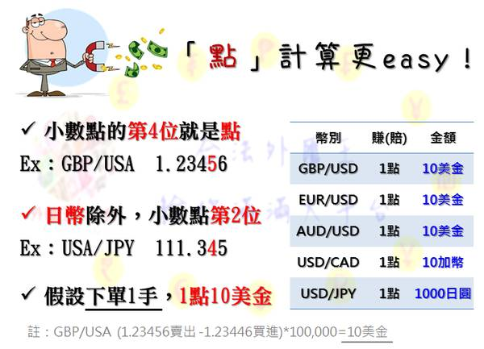
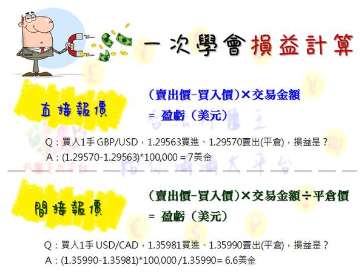

# 點差計算

## 外匯保證金交易的賺賠如何計算？

 

先告訴大家一個基本觀念，在所有匯率報價中，通常會報價

至**小數點第五位。(日元除外)**

 

例如

GBP/USA = 1.56789，這是指1英鎊可以兌換成1.56789美金，

這樣的報價方式又稱為**直接報價。 **

(其中英鎊GBP、歐元EUR、澳幣AUD都採直接報價)

 

USA/CAD = 1.12345，這是指1美金可以兌換成1.12345加幣，

這樣的報價方式又稱為**間接報價。**

(其中加幣CAD、日幣JPY都採間接報價)

 

 

兩種報價方式的賺賠金額計算不同，以下我們分別舉例：

(假設本金為10萬美元)

 

###直接報價(如EUR/USD、 AUD/USD)

 

損益計算方法：**(賣出價 - 買入價) x 交易金額 = 盈虧 (美元 )**

舉例：於 1.2200 買入 10 萬 EUR/USD，於 1.2350 賣出 10 萬 EUR/USD 平倉。

(1.2350 - 1.2200) x 100,000 = +USD 1,500

 

 

###間接報價(如USD/JPY 、USD/CAD)

 

計算方法：**(賣出價 - 買入價)× 交易金額 ÷ 平倉價 = 盈虧 (美元 )**

舉例：於109.00買入10萬USD/JPY，後於108.00賣出10萬USD/JPY平倉。

( 108.00 － 109.00) × 100,000 ÷ 108.00 ＝ － USD 925.925

 

 

但在實務上，我們通常會採取更直觀的方式來幫助我們計算盈虧

，也就是我們常聽到的`"點"`的計算方式。