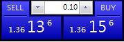
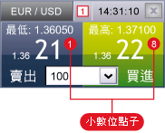

# 點差計算

## 外匯保證金交易的賺賠如何計算？

 

先告訴大家一個基本觀念，在所有匯率報價中，通常會報價

至**小數點第五位。(日元除外)**

 

例如

GBP/USA = 1.56789，這是指1英鎊可以兌換成1.56789美金，

這樣的報價方式又稱為**直接報價。 **

(其中英鎊GBP、歐元EUR、澳幣AUD都採直接報價)

 

USA/CAD = 1.12345，這是指1美金可以兌換成1.12345加幣，

這樣的報價方式又稱為**間接報價。**

(其中加幣CAD、日幣JPY都採間接報價)

 

 

兩種報價方式的賺賠金額計算不同，以下我們分別舉例：

(假設本金為10萬美元)

 

###直接報價(如EUR/USD、 AUD/USD)

 

損益計算方法：**(賣出價 - 買入價) x 交易金額 = 盈虧 (美元 )**

舉例：於 1.2200 買入 10 萬 EUR/USD，於 1.2350 賣出 10 萬 EUR/USD 平倉。

(1.2350 - 1.2200) x 100,000 = +USD 1,500

 

 

###間接報價(如USD/JPY 、USD/CAD)

 

計算方法：**(賣出價 - 買入價)× 交易金額 ÷ 平倉價 = 盈虧 (美元 )**

舉例：於109.00買入10萬USD/JPY，後於108.00賣出10萬USD/JPY平倉。

( 108.00 － 109.00) × 100,000 ÷ 108.00 ＝ － USD 925.925

 

 

但在實務上，我們通常會採取更直觀的方式來幫助我們計算盈虧

，也就是我們常聽到的`"點"`的計算方式。

---

市場上外匯交易的平台，有五位制報價和四位數報價兩種，其最後一位小數數字稱為。四位小數報價的平台，以第四位小數為交易單位，稱為點(point)或大點。五位小數報價的平台，以小數點後面第五位數為交易單位，稱為點或小點(0.1點)。四位數報價制的1(大)點 = 五位數報價(小)點的10倍。

以四位數報價為例：

1歐元=1.5711美元； 
歐元對美元從1.5710變為1.5715,稱歐元對美元上升了5點

1美元=120.55日元 
美元對日元從120.50變為120.00，稱美元對日元下跌了50點

以五位數報價為例(如下圖)：歐元兌美元，匯率1.36000來說，1歐元可兑換1.36000美元。

上圖中，SELL與BUY中間的數字為下單的手數(lot)大小(size)，為0.1手。

從上圖(在MT4線圖中上，按右鍵，點"按一下交易"就可以顯示)中可以看出：買單與賣單分別是1.36136與1.36156，中間的價差，稱**【點差】**，可視為平台收取的交易手續費。

【例】以十分之一點提供報價，就熱門貨幣對提供較低的買賣差價。代表【十分之一點】的數字顯示於兩個較大及粗體的數字的**右上角**。

一般來說，EURUSD的市場行情，點差約在 20點 (2大點) 上下浮動；黃金則是50點左右，越少人交易的貨幣買賣價差通常就越大。點差與你的資金規模大小也會有關係。