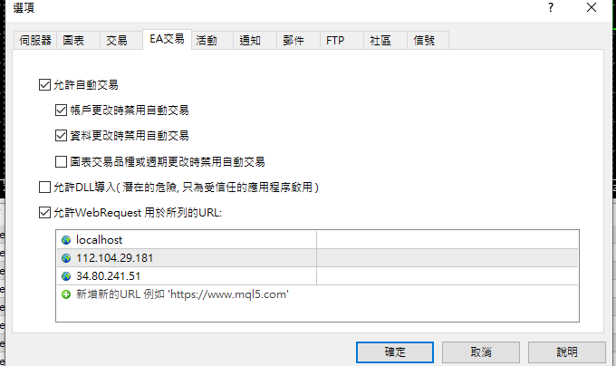
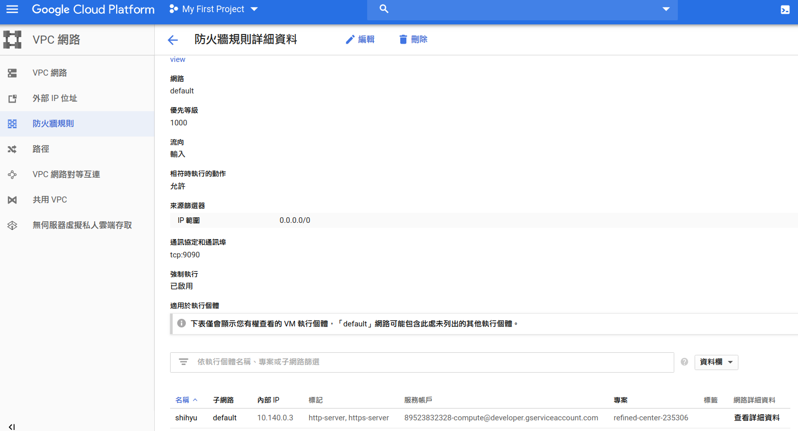

# gcp 與 MT5 透過socket


## MT5 新增webRequest
- gcp ip : 34.80.241.51





## gcp 防火牆規則新增 9090 port




## socket ip 要用gcp 內部ip 應該有mapping 關係

```sh
[GCP@~]$ ifconfig 
ens4: flags=4163<UP,BROADCAST,RUNNING,MULTICAST>  mtu 1460
        inet 10.140.0.3  netmask 255.255.255.255  broadcast 0.0.0.0
        inet6 fe80::4001:aff:fe8c:3  prefixlen 64  scopeid 0x20<link>
        ether 42:01:0a:8c:00:03  txqueuelen 1000  (Ethernet)
        RX packets 32474626  bytes 34101945871 (34.1 GB)
        RX errors 0  dropped 0  overruns 0  frame 3990
        TX packets 34804218  bytes 3909916459 (3.9 GB)
        TX errors 0  dropped 0 overruns 0  carrier 0  collisions 0

lo: flags=73<UP,LOOPBACK,RUNNING>  mtu 65536
        inet 127.0.0.1  netmask 255.0.0.0
        inet6 ::1  prefixlen 128  scopeid 0x10<host>
        loop  txqueuelen 1000  (Local Loopback)
        RX packets 11636864  bytes 1036534050 (1.0 GB)
        RX errors 0  dropped 0  overruns 0  frame 0
        TX packets 11636864  bytes 1036534050 (1.0 GB)
        TX errors 0  dropped 0 overruns 0  carrier 0  collisions 0
```


```py
# -*- coding: utf-8 -*-
"""
Created on Tue Feb 19 01:52:04 2019

@author: dmitrievsky
"""
import socket, numpy as np
from sklearn.linear_model import LinearRegression

class socketserver:
    def __init__(self, address = '', port = 9090):
        self.sock = socket.socket(socket.AF_INET, socket.SOCK_STREAM)
        self.address = address
        self.port = port
        self.sock.bind((self.address, self.port))
        self.cummdata = ''
        
    def recvmsg(self):
        self.sock.listen(1)
        self.conn, self.addr = self.sock.accept()
        print('connected to', self.addr)
        self.cummdata = ''

        while True:
            data = self.conn.recv(10000)
            self.cummdata+=data.decode("utf-8")
            if not data:
                break    
            self.conn.send(bytes(calcregr(self.cummdata), "utf-8"))
            return self.cummdata
            
    def __del__(self):
        self.sock.close()
        
def calcregr(msg = ''):
    chartdata = np.fromstring(msg, dtype=float, sep= ' ') 
    Y = np.array(chartdata).reshape(-1,1)
    X = np.array(np.arange(len(chartdata))).reshape(-1,1)
        
    lr = LinearRegression()
    lr.fit(X, Y)
    Y_pred = lr.predict(X)

    P = Y_pred.astype(str).item(-1) + ' ' + Y_pred.astype(str).item(0)
    print(P)
    return str(P)
    
serv = socketserver('10.140.0.3', 9090)

while True:  
    msg = serv.recvmsg()
```